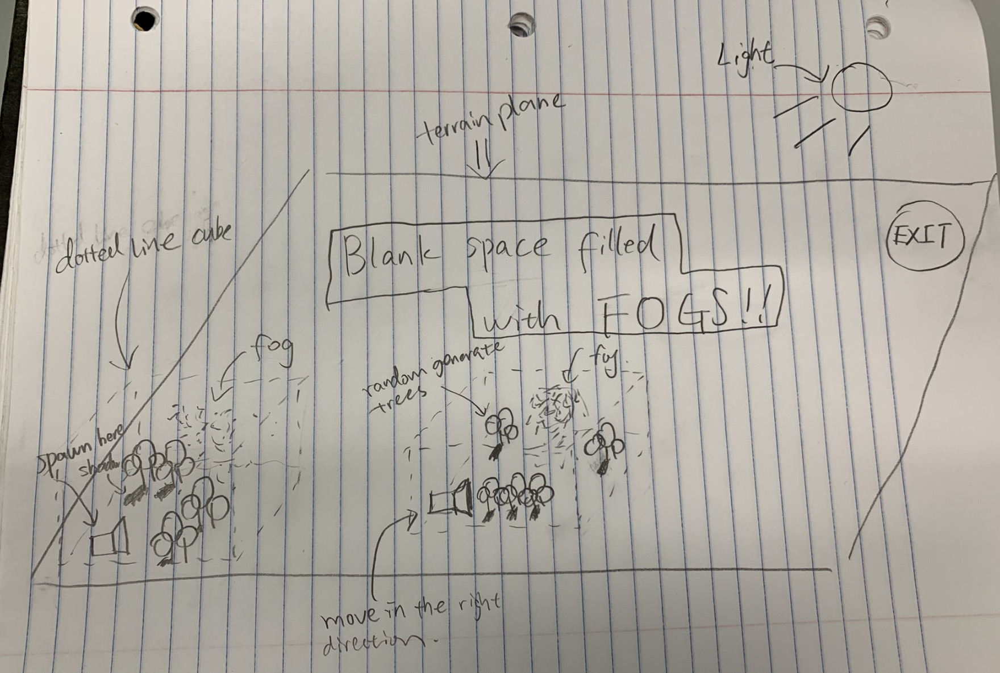

## Project Name: Random Land

### Team Members:
A53302898 Xu, Wei

A13487193 Wei, Zeng

### Project Description:
We plan to implement a foggy thriller escape game with randomly generated trees and terrains. Our game starts with placing the player at a random position in our scene and the goal of the player is to find the exit of our tree maze. As player moves around the terrain, the trees surrounding him will be randomly generated and the player will see shadow mapped to the fog's particles. If the player successfully reach the exit, we remove the fog and switch the whole scene to Toon Shading. Lastly replace the thriller music with a cheerful one.

### Technical Points:

#### Easy
1. Toon Shading
2. Particle Effect
3. First person camera
4. Selection Buffer
5. Collision detection with bounding spheres or boxes
6. Sound effects

#### Medium
1. Procedurally generated Terrain
2. Procedurally generated plants with L-systems
3. Shadow mapping

### What's Creative:
We believe that the most creative part of the game would be the drastic contrast from thriller to cartoon at the end of the game which hopefully would give us an surprisingly entertaining effect.

### Sketching:

The boundaries of how far we randomly generate trees are defined by the dotted line cube surrounding our camera. As the camera moves, the cube moves with it so that every time we move to a new position on our terrain plain, we see trees with different shapes and at different spots. We don't render any trees outside the cube since the player would not be able to see very far due to the fog.

## Blog 2:

### Update
We realized that volumetric fog effect might be a little too complicated to implement with the given amount of time. Therefore we might just we might remove the fog effect or take an easier technique if time allows. We might also discard Particle Effect and Shadow mapping.

### - What we did last week
We prioritized some technical points such as the Procedurally generated terrain and plants, the Toon shading and the first person camera movement on the terrain. The Procedurally generated terrain was implement by Xu with the diamond square algorithm and the plants generation was implemented by Wei with the L-system.

<!-- TODO -->

